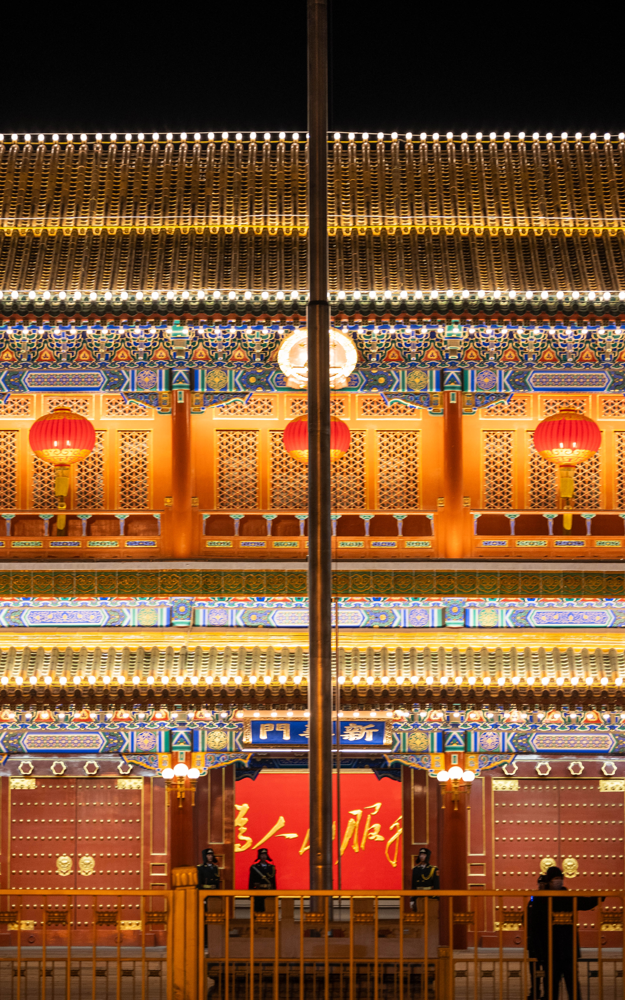

## 2024年度总结

> 胸中正可吞云梦，盏里何妨对圣贤？
>
> 有意清秋入衡霍，为君无尽写江天。
>
> ——晁补之

 2024，这一年途经了很多城市，遇到了有趣的人，也经历了很多故事。

 但更多的是在沉淀，仅以摄影作品总结我的2024！

 亦有日复一日，落笔生花，写下自己的故事。

## January
 
中南海

>

国家大剧院

>

-故宫-什刹海滑冰-XTU校友年会
